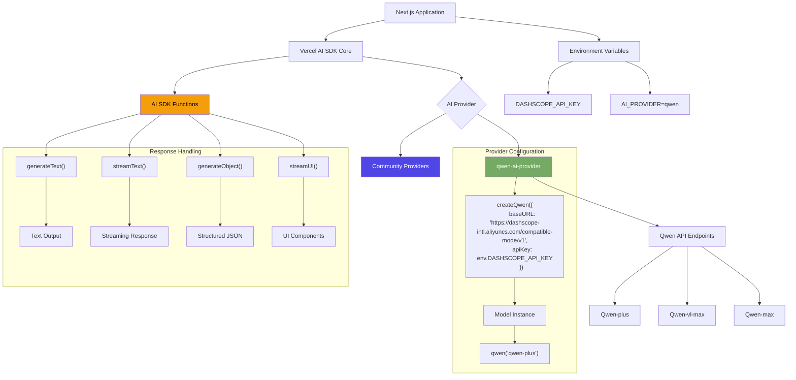

# Qwen AI Provider for Vercel AI SDK v6

[](https://sdk.vercel.ai/providers/community-providers/qwen)
[](https://www.npmjs.com/package/qwen-ai-provider-v5)

> **Important Notice**: This package (`qwen-ai-provider-v5`) supports multiple AI SDK versions:
>
> - **v2.0.0+**: Designed for **AI SDK v6** (specification v3) - **Current version**
> - **v1.x**: For **AI SDK v5** (specification v2) users
> - For AI SDK v4 users, please use the original [`qwen-ai-provider`](https://www.npmjs.com/package/qwen-ai-provider) package.
>
> This is a community-maintained fork. Special thanks to the [original author](https://github.com/Younis-Ahmed/qwen-ai-provider) for their excellent work.

## Table of Contents

- [Diagram](#diagram)
- [Environment Variable](#enviroment-variable)
- [Setup](#setup)
- [Provider Instance](#provider-instance)
- [Language Models](#language-models)
- [Embedding Models](#embedding-models)
- [Reranking Models](#reranking-models)
- [Examples](#examples)

This package enables seamless integration of **Alibaba Cloud's Qwen language models** with applications built using **Vercel AI SDK v6**. Key features:

- Full compatibility with AI SDK v6's `generateText`, `streamText`, `rerank`, and tool-calling functions
- Support for 15+ Qwen models including `qwen-plus`, `qwen-vl-max`, `qwen2.5 series`, and `qwen3-reranker`
- Customizable API configurations for enterprise deployments
- Complete specification v3 implementation with enhanced usage tracking, improved finish reasons, and better tool support
- **NEW**: Reranking support with Qwen3-Reranker models for improved search relevance

### Original Repository

This is a maintained fork of the original [qwen-ai-provider](https://github.com/Younis-Ahmed/qwen-ai-provider) repository, updated for AI SDK v6 compatibility. We deeply appreciate the original author's contribution to the community.

---

## Diagram

<!-- Description or alt text for the diagram -->

### Architecture diagram showing Qwen provider integration with Vercel AI SDK



---

## Enviroment Variable

```ts
DASHSCOPE_API_KEY = ""
```

## Setup

The Qwen provider for AI SDK v6 is available in the `qwen-ai-provider-v5` module. You can install it with:

```bash
# For pnpm (AI SDK v6)
pnpm add qwen-ai-provider-v5@^2 ai@^6.0.0
```

```bash
# For npm (AI SDK v6)
npm install qwen-ai-provider-v5@^2 ai@^6.0.0
```

```bash
# For yarn (AI SDK v6)
yarn add qwen-ai-provider-v5@^2 ai@^6.0.0
```

> **Note**:
>
> - **v2.0.0+** requires **AI SDK v6** (`ai@^6.0.0`)
> - **v1.x** supports **AI SDK v5** (`ai@^5.0.0`)
> - For AI SDK v4, please use the original [`qwen-ai-provider`](https://www.npmjs.com/package/qwen-ai-provider) package instead.

### Zod Compatibility

- Supports `zod` versions: `^3.25.76` or `^4.1.8`.
- This matches the peer dependency range required by `@ai-sdk/provider-utils@^4.0.0` to ensure installs resolve cleanly.
- The provider uses only APIs compatible with both ranges.

## Provider Instance

You can import the default provider instance `qwen` from `qwen-ai-provider-v5`:

```ts
import { qwen } from "qwen-ai-provider-v5"
```

If you need a customized setup, you can import `createQwen` from `qwen-ai-provider-v5` and create a provider instance with your settings:

```ts
import { createQwen } from "qwen-ai-provider-v5"

const qwen = createQwen({
  // optional settings, e.g.
  // baseURL: 'https://qwen/api/v1',
})
```

You can use the following optional settings to customize the Qwen provider instance:

- **baseURL** _string_

  Use a different URL prefix for API calls, e.g., to use proxy servers. The default prefix is `https://dashscope-intl.aliyuncs.com/compatible-mode/v1`.

- **apiKey** _string_

  API key that is being sent using the `Authorization` header. It defaults to the `DASHSCOPE_API_KEY` environment variable.

- **headers** _Record&lt;string,string&gt;_

  Custom headers to include in the requests.

- **fetch** _(input: RequestInfo, init?: RequestInit) => Promise&lt;Response&gt;_

  Custom [fetch](https://developer.mozilla.org/en-US/docs/Web/API/fetch) implementation. Defaults to the global `fetch` function. You can use it as a middleware to intercept requests, or to provide a custom fetch implementation for e.g., testing.

## Language Models

You can create models that call the [Qwen chat API](https://www.alibabacloud.com/help/en/model-studio/developer-reference/use-qwen-by-calling-api) using a provider instance. The first argument is the model id, e.g., `qwen-plus`. Some Qwen chat models support tool calls.

```ts
const model = qwen("qwen-plus")
```

### Example

You can use Qwen language models to generate text with the `generateText` function:

```ts
import { generateText } from "ai"
import { qwen } from "qwen-ai-provider-v5"

const { text } = await generateText({
  model: qwen("qwen-plus"),
  prompt: "Write a vegetarian lasagna recipe for 4 people.",
})
```

> **Note**
> Qwen language models can also be used in the `streamText`, `generateText` with `output` setting (replaces `generateObject`), and `streamUI` functions (see [AI SDK Core](https://sdk.vercel.ai/docs/ai-sdk-core) and [AI SDK RSC](https://sdk.vercel.ai/docs/ai-sdk-rsc)).

### Model Capabilities

| Model                     | Image Input        | Object Generation  | Tool Usage         | Tool Streaming     |
| ------------------------- | ------------------ | ------------------ | ------------------ | ------------------ |
| `qwen-vl-max`             | :heavy_check_mark: | :heavy_check_mark: | :heavy_check_mark: | :heavy_check_mark: |
| `qwen-plus-latest`        | :x:                | :heavy_check_mark: | :heavy_check_mark: | :heavy_check_mark: |
| `qwen-max`                | :x:                | :heavy_check_mark: | :heavy_check_mark: | :heavy_check_mark: |
| `qwen2.5-72b-instruct`    | :x:                | :heavy_check_mark: | :heavy_check_mark: | :heavy_check_mark: |
| `qwen2.5-14b-instruct-1m` | :x:                | :heavy_check_mark: | :heavy_check_mark: | :heavy_check_mark: |
| `qwen2.5-vl-72b-instruct` | :heavy_check_mark: | :heavy_check_mark: | :heavy_check_mark: | :heavy_check_mark: |

> **Note**
> The table above lists popular models. Please see the [Qwen docs](https://www.alibabacloud.com/help/en/model-studio/getting-started/models) for a full list of available models. You can also pass any available provider model ID as a string if needed.

## Embedding Models

You can create models that call the [Qwen embeddings API](https://www.alibabacloud.com/help/en/model-studio/getting-started/models#cff6607866tsg) using the `.embeddingModel()` factory method (or `.textEmbeddingModel()` for backward compatibility).

```ts
// Recommended: Use embeddingModel (AI SDK v6)
const model = qwen.embeddingModel("text-embedding-v3")

// Also supported: textEmbeddingModel (deprecated, but still works)
const modelLegacy = qwen.textEmbeddingModel("text-embedding-v3")
```

### Model Capabilities

| Model               | Default Dimensions | Maximum number of rows | Maximum tokens per row |
| ------------------- | ------------------ | ---------------------- | ---------------------- |
| `text-embedding-v3` | 1024               | 6                      | 8,192                  |

## Reranking Models

You can create models that call the [Qwen reranking API](https://qwenlm.github.io/blog/qwen3-embedding/) using the `.rerankingModel()` factory method. Reranking models improve search relevance by reordering documents based on their semantic similarity to a query.

> **Note for Chinese users (中国用户)**
>
> If you're using a Chinese API key from `dashscope.aliyuncs.com`, you need to specify the domestic endpoint:
>
> ```ts
> import { createQwen } from "qwen-ai-provider-v5"
>
> const qwen = createQwen({
>   baseURL: "https://dashscope.aliyuncs.com/compatible-mode/v1",
> })
> ```

```ts
const model = qwen.rerankingModel("gte-rerank-v2")
```

### Example

```ts
import { rerank } from "ai"
import { qwen } from "qwen-ai-provider-v5"

const { ranking, rerankedDocuments } = await rerank({
  model: qwen.rerankingModel("gte-rerank-v2"),
  documents: [
    "sunny day at the beach",
    "rainy afternoon in the city",
    "snowy night in the mountains",
  ],
  query: "talk about rain",
  topN: 2,
})

console.log(rerankedDocuments)
// ['rainy afternoon in the city', 'sunny day at the beach']

console.log(ranking)
// [
//   { originalIndex: 1, score: 0.95, document: 'rainy afternoon in the city' },
//   { originalIndex: 0, score: 0.72, document: 'sunny day at the beach' }
// ]
```

### Model Capabilities

| Model                 | Parameters | Sequence Length | Instruction Aware  |
| --------------------- | ---------- | --------------- | ------------------ |
| `gte-rerank-v2`       | -          | -               | :x:                |
| `qwen3-reranker-0.6b` | 0.6B       | 32K             | :heavy_check_mark: |
| `qwen3-reranker-4b`   | 4B         | 32K             | :heavy_check_mark: |
| `qwen3-reranker-8b`   | 8B         | 32K             | :heavy_check_mark: |

> **Note**
> Qwen3-Reranker models support over 100 languages and achieve state-of-the-art performance on multiple reranking benchmarks. See the [Qwen3 Embedding blog](https://qwenlm.github.io/blog/qwen3-embedding/) for more details.

## Examples

Below are comprehensive examples demonstrating various AI functionalities:

### generate-text.ts

```typescript
// Import the text generation function from the AI package
import { generateText } from "ai"

// Import the qwen function from qwen-ai-provider-v5 to select the AI model
import { qwen } from "qwen-ai-provider-v5"

// Use generateText with a specific model and prompt to generate AI text
// The qwen function selects the 'qwen-plus' model
const result = await generateText({
  model: qwen("qwen-plus"), // Select the desired AI model
  prompt: "Why is the sky blue?", // Define the prompt for the AI
})

// Log the result from the AI text generation
console.log(result)
```

### generate-text-image-prompt.ts

```typescript
import { generateText } from "ai"
import { qwen } from "qwen-ai-provider-v5"

const result = await generateText({
  model: qwen("qwen-plus"),
  maxTokens: 512,
  messages: [
    {
      role: "user",
      content: [
        {
          type: "text",
          text: "what are the red things in this image?",
        },
        {
          type: "image",
          image: new URL(
            "https://upload.wikimedia.org/wikipedia/commons/thumb/3/3e/2024_Solar_Eclipse_Prominences.jpg/720px-2024_Solar_Eclipse_Prominences.jpg",
          ),
        },
      ],
    },
  ],
})

console.log(result)
```

### generate-text-chat-prompt.ts

```typescript
import { generateText } from "ai"
import { qwen } from "qwen-ai-provider-v5"

const result = await generateText({
  model: qwen("qwen-plus"),
  maxTokens: 1024,
  system: "You are a helpful chatbot.",
  messages: [
    {
      role: "user",
      content: "Hello!",
    },
    {
      role: "assistant",
      content: "Hello! How can I help you today?",
    },
    {
      role: "user",
      content: "I need help with my computer.",
    },
  ],
})

console.log(result.text)
```

### generate-object.ts

```typescript
import { generateText } from "ai"
import { qwen } from "qwen-ai-provider-v5"
import { z } from "zod"

// AI SDK v6: Use generateText with output setting instead of generateObject
const result = await generateText({
  model: qwen("qwen-plus"),
  output: {
    schema: z.object({
      recipe: z.object({
        name: z.string(),
        ingredients: z.array(
          z.object({
            name: z.string(),
            amount: z.string(),
          }),
        ),
        steps: z.array(z.string()),
      }),
    }),
  },
  prompt: "Generate a lasagna recipe.",
})

console.log(JSON.stringify(result.object.recipe, null, 2))
```

### generate-obj-reasoning-mdl.ts

````typescript
import { generateObject, generateText } from "ai"
### generate-object-reasoning-mdl.ts

```typescript
import { generateText } from "ai"
import { qwen } from "qwen-ai-provider-v5"
import { z } from "zod"
import "dotenv/config"

async function main() {
  const { text: rawOutput } = await generateText({
    model: qwen("qwen-max"),
    prompt:
      "Predict the top 3 largest city by 2050. For each, return the name, the country, the reason why it will on the list, and the estimated population in millions.",
  })

  // AI SDK v6: Use generateText with output setting
  const { object } = await generateText({
    model: qwen("qwen-max"),
    prompt: `Extract the desired information from this text: \n${rawOutput}`,
    output: {
      schema: z.object({
        name: z.string().describe("the name of the city"),
        country: z.string().describe("the name of the country"),
        reason: z
          .string()
          .describe(
            "the reason why the city will be one of the largest cities by 2050",
          ),
        estimatedPopulation: z.number(),
      }),
      mode: "array",
    },
  })

  console.log(object)
}

main().catch(console.error)
````

### embed-text.ts

```typescript
import { embed } from "ai"
import { qwen } from "qwen-ai-provider-v5"
import "dotenv/config"

async function main() {
  const { embedding, usage } = await embed({
    // Use embeddingModel (recommended) or textEmbeddingModel (deprecated)
    model: qwen.embeddingModel("text-embedding-v3"),
    value: "sunny day at the beach",
  })

  console.log(embedding)
  console.log(usage)
}

main().catch(console.error)
```

### embed-text-batch.ts

```typescript
import { embedMany } from "ai"
import { qwen } from "qwen-ai-provider-v5"
import "dotenv/config"

async function main() {
  const { embeddings, usage } = await embedMany({
    // Use embeddingModel (recommended) or textEmbeddingModel (deprecated)
    model: qwen.embeddingModel("text-embedding-v3"),
    values: [
      "sunny day at the beach",
      "rainy afternoon in the city",
      "snowy night in the mountains",
    ],
  })

  console.log(embeddings)
  console.log(usage)
}

main().catch(console.error)
```

### call-tools.ts

```typescript
import { generateText, tool } from "ai"
import { qwen } from "qwen-ai-provider-v5"
import { z } from "zod"

const result = await generateText({
  model: qwen("qwen-plus"),
  tools: {
    weather: tool({
      description: "Get the weather in a location",
      parameters: z.object({
        location: z.string().describe("The location to get the weather for"),
      }),
      execute: async ({ location }) => ({
        location,
        temperature: 72 + Math.floor(Math.random() * 21) - 10,
      }),
    }),
    cityAttractions: tool({
      parameters: z.object({ city: z.string() }),
    }),
  },
  prompt:
    "What is the weather in San Francisco and what attractions should I visit?",
})
```

### record-token-usage-after-streaming-object.ts

```typescript
import { streamText } from "ai"
import { qwen } from "qwen-ai-provider-v5"
import { z } from "zod"

// AI SDK v6: Use streamText with output setting instead of streamObject
const result = streamText({
  model: qwen("qwen-plus"),
  output: {
    schema: z.object({
      recipe: z.object({
        name: z.string(),
        ingredients: z.array(z.string()),
        steps: z.array(z.string()),
      }),
    }),
  },
  prompt: "Generate a lasagna recipe.",
  onFinish({ usage }) {
    console.log("Token usage:", usage)
  },
})
```

### rerank-documents.ts

```typescript
import { rerank } from "ai"
import { qwen } from "qwen-ai-provider-v5"
import "dotenv/config"

async function main() {
  const documents = [
    "Machine learning is a subset of artificial intelligence.",
    "Paris is the capital city of France.",
    "Neural networks are inspired by the human brain.",
    "The Eiffel Tower is located in Paris.",
    "Deep learning uses multiple layers of neural networks.",
  ]

  const { ranking, rerankedDocuments } = await rerank({
    model: qwen.rerankingModel("gte-rerank-v2"),
    documents,
    query: "What is artificial intelligence and machine learning?",
    topN: 3,
  })

  console.log("Reranked documents:", rerankedDocuments)
  // ['Machine learning is a subset...', 'Deep learning uses...', 'Neural networks are...']

  console.log("Ranking with scores:")
  ranking.forEach((item) => {
    console.log(`  Index ${item.originalIndex}: Score ${item.score.toFixed(3)}`)
    console.log(`  Document: ${item.document}\n`)
  })
}

main().catch(console.error)
```

### rerank-with-objects.ts

```typescript
import { rerank } from "ai"
import { qwen } from "qwen-ai-provider-v5"
import "dotenv/config"

async function main() {
  // Reranking also works with object documents
  const documents = [
    { id: "1", title: "AI Basics", text: "Machine learning is a subset of AI." },
    { id: "2", title: "Geography", text: "Paris is the capital of France." },
    { id: "3", title: "Neural Nets", text: "Neural networks mimic the brain." },
  ]

  const { ranking } = await rerank({
    model: qwen.rerankingModel("qwen3-reranker-0.6b"),
    documents,
    query: "How does artificial intelligence work?",
    topN: 2,
  })

  // Access the original object from ranking results
  console.log("Top result:", ranking[0].document)
  // { id: '1', title: 'AI Basics', text: 'Machine learning is a subset of AI.' }
}

main().catch(console.error)
```
