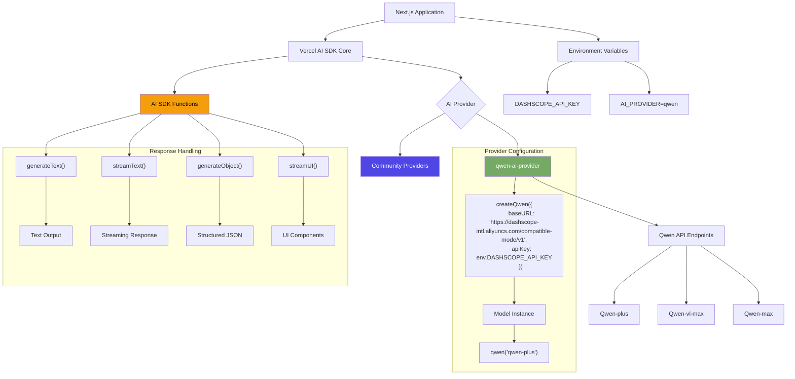

# Qwen AI Provider for Vercel AI SDK  
[](https://sdk.vercel.ai/providers/community-providers/qwen)

## Table of Contents
- [Qwen AI Provider for Vercel AI SDK](#qwen-ai-provider-for-vercel-ai-sdk)
- [Diagram](#diagram)
- [Environment Variable](#enviroment-variable)
- [Setup](#setup)
- [Provider Instance](#provider-instance)
- [Language Models](#language-models)
- [Embedding Models](#embedding-models)
- [Examples](#examples)

[younis-ahmed/qwen-vercel-ai-sdk-provider](https://github.com/younis-ahmed/qwen-ai-provider) enables seamless integration of **Alibaba Cloud's Qwen language models** with applications built using **Vercel AI SDK**. This community-maintained provider supports:  

- Full compatibility with Vercel AI SDK's `generateText`, `streamText`, and tool-calling functions.
- 15+ Qwen models including `qwen-plus`, `qwen-vl-max`, and `qwen2.5 series`.
- Customizable API configurations for enterprise deployments.

---


## Diagram
<!-- Description or alt text for the diagram -->
### Architecture diagram showing Qwen provider integration with Vercel AI SDK




---


## Enviroment Variable
```ts
DASHSCOPE_API_KEY=""
```

## Setup

The Qwen provider is available in the `qwen-ai-provider` module. You can install it with:

```bash
# For pnpm
pnpm add qwen-ai-provider
```

```bash
# For npm
npm install qwen-ai-provider
```

```bash
# For yarn
yarn add qwen-ai-provider
```

### Zod Compatibility
- Supports `zod` versions: `^3.25.76` or `^4.1.8`.
- This matches the peer dependency range required by `@ai-sdk/provider-utils@3.x` to ensure installs resolve cleanly.
- The provider uses only APIs compatible with both ranges.

## Provider Instance

You can import the default provider instance `qwen` from `qwen-ai-provider`:

```ts
import { qwen } from 'qwen-ai-provider';
```

If you need a customized setup, you can import `createQwen` from `qwen-ai-provider` and create a provider instance with your settings:

```ts
import { createQwen } from 'qwen-ai-provider';

const qwen = createQwen({
  // optional settings, e.g.
  // baseURL: 'https://qwen/api/v1',
});
```

You can use the following optional settings to customize the Qwen provider instance:

- **baseURL** _string_

  Use a different URL prefix for API calls, e.g., to use proxy servers. The default prefix is `https://dashscope-intl.aliyuncs.com/compatible-mode/v1`.

- **apiKey** _string_

  API key that is being sent using the `Authorization` header. It defaults to the `DASHSCOPE_API_KEY` environment variable.

- **headers** _Record&lt;string,string&gt;_

  Custom headers to include in the requests.

- **fetch** _(input: RequestInfo, init?: RequestInit) => Promise&lt;Response&gt;_

  Custom [fetch](https://developer.mozilla.org/en-US/docs/Web/API/fetch) implementation. Defaults to the global `fetch` function. You can use it as a middleware to intercept requests, or to provide a custom fetch implementation for e.g., testing.

## Language Models

You can create models that call the [Qwen chat API](https://www.alibabacloud.com/help/en/model-studio/developer-reference/use-qwen-by-calling-api) using a provider instance. The first argument is the model id, e.g., `qwen-plus`. Some Qwen chat models support tool calls.

```ts
const model = qwen('qwen-plus');
```

### Example

You can use Qwen language models to generate text with the `generateText` function:

```ts
import { qwen } from 'qwen-ai-provider';
import { generateText } from 'ai';

const { text } = await generateText({
  model: qwen('qwen-plus'),
  prompt: 'Write a vegetarian lasagna recipe for 4 people.',
});
```
> **Note**
> Qwen language models can also be used in the `streamText`, `generateObject`, `streamObject`, and `streamUI` functions (see [AI SDK Core](/docs/ai-sdk-core) and [AI SDK RSC](/docs/ai-sdk-rsc)).

### Model Capabilities

| Model                     | Image Input | Object Generation | Tool Usage | Tool Streaming |
| ------------------------- | ------------------ | ----------------- | ------------------ | ------------------ |
| `qwen-vl-max`             | :heavy_check_mark: | :heavy_check_mark:| :heavy_check_mark: | :heavy_check_mark: |
| `qwen-plus-latest`        | :x:                | :heavy_check_mark:| :heavy_check_mark: | :heavy_check_mark: |
| `qwen-max`                | :x:                | :heavy_check_mark:| :heavy_check_mark: | :heavy_check_mark: |
| `qwen2.5-72b-instruct`    | :x:                | :heavy_check_mark:| :heavy_check_mark: | :heavy_check_mark: |
| `qwen2.5-14b-instruct-1m` | :x:                | :heavy_check_mark:| :heavy_check_mark: | :heavy_check_mark: |
| `qwen2.5-vl-72b-instruct` | :heavy_check_mark: | :heavy_check_mark:| :heavy_check_mark: | :heavy_check_mark: |

> **Note**  
> The table above lists popular models. Please see the [Qwen docs](https://www.alibabacloud.com/help/en/model-studio/getting-started/models) for a full list of available models. You can also pass any available provider model ID as a string if needed.

## Embedding Models

You can create models that call the [Qwen embeddings API](https://www.alibabacloud.com/help/en/model-studio/getting-started/models#cff6607866tsg) using the `.textEmbeddingModel()` factory method.

```ts
const model = qwen.textEmbeddingModel('text-embedding-v3');
```

### Model Capabilities

| Model               | Default Dimensions | Maximum number of rows | Maximum tokens per row |
| ------------------- | ------------------ | ---------------------- | ---------------------- |
| `text-embedding-v3` | 1024               | 6                      | 8,192                  |


## Examples

Below are comprehensive examples demonstrating various AI functionalities:


### generate-text.ts

```typescript
// Import the text generation function from the AI package
import { generateText } from "ai"

// Import the qwen function from qwen-ai-provider to select the AI model
import { qwen } from "qwen-ai-provider"

// Use generateText with a specific model and prompt to generate AI text
// The qwen function selects the 'qwen-plus' model
const result = await generateText({
  model: qwen("qwen-plus"), // Select the desired AI model
  prompt: "Why is the sky blue?", // Define the prompt for the AI
})

// Log the result from the AI text generation
console.log(result)

```

### generate-text-image-prompt.ts
```typescript
import { generateText } from 'ai';
import { qwen } from 'qwen-ai-provider'

const result = await generateText({
  model: qwen('qwen-plus'),
  maxTokens: 512,
  messages: [
    {
      role: 'user',
      content: [
        {
          type: 'text',
          text: 'what are the red things in this image?',
        },
        {
          type: 'image',
          image: new URL(
            'https://upload.wikimedia.org/wikipedia/commons/thumb/3/3e/2024_Solar_Eclipse_Prominences.jpg/720px-2024_Solar_Eclipse_Prominences.jpg',
          ),
        },
      ],
    },
  ],
});

console.log(result);
```

### generate-text-chat-prompt.ts
```typescript
import { generateText } from 'ai';
import { qwen } from 'qwen-ai-provider';

const result = await generateText({
  model: qwen('qwen-plus'),
  maxTokens: 1024,
  system: 'You are a helpful chatbot.',
  messages: [
    {
      role: 'user',
      content: 'Hello!',
    },
    {
      role: 'assistant',
      content: 'Hello! How can I help you today?',
    },
    {
      role: 'user',
      content: 'I need help with my computer.',
    },
  ],
});

console.log(result.text);
```

### generate-obj.ts
```typescript
import { generateObject } from 'ai';
import { qwen } from 'qwen-ai-provider';
import { z } from 'zod';

const result = await generateObject({
  model: qwen('qwen-plus'),
  schema: z.object({
    recipe: z.object({
      name: z.string(),
      ingredients: z.array(
        z.object({
          name: z.string(),
          amount: z.string(),
        }),
      ),
      steps: z.array(z.string()),
    }),
  }),
  prompt: 'Generate a lasagna recipe.',
});

console.log(JSON.stringify(result.object.recipe, null, 2));
```

### generate-obj-reasoning-mdl.ts
```typescript
import { qwen } from 'qwen-ai-provider';
import { generateObject, generateText } from 'ai';
import 'dotenv/config';
import { z } from 'zod';

async function main() {
  const { text: rawOutput } = await generateText({
    model: qwen('qwen-max'),
    prompt:
      'Predict the top 3 largest city by 2050. For each, return the name, the country, the reason why it will on the list, and the estimated population in millions.',
  });

  const { object } = await generateObject({
    model: qwen('qwen-max'),
    prompt: 'Extract the desired information from this text: \n' + rawOutput,
    schema: z.object({
      name: z.string().describe('the name of the city'),
      country: z.string().describe('the name of the country'),
      reason: z
        .string()
        .describe(
          'the reason why the city will be one of the largest cities by 2050',
        ),
      estimatedPopulation: z.number(),
    }),
    output: 'array',
  });

  console.log(object);
}

main().catch(console.error);
```

### embed-text.ts
```typescript
import { qwen } from 'qwen-ai-provider';
import { embed } from 'ai';
import 'dotenv/config';

async function main() {
  const { embedding, usage } = await embed({
    model: qwen.textEmbeddingModel('text-embedding-v3'),
    value: 'sunny day at the beach',
  });

  console.log(embedding);
  console.log(usage);
}

main().catch(console.error);
```

### embed-text-batch.ts
```typescript
import { qwen } from 'qwen-ai-provider';
import { embedMany } from 'ai';
import 'dotenv/config';

async function main() {
  const { embeddings, usage } = await embedMany({
    model: qwen.textEmbeddingModel('text-embedding-v3'),
    values: [
      'sunny day at the beach',
      'rainy afternoon in the city',
      'snowy night in the mountains',
    ],
  });

  console.log(embeddings);
  console.log(usage);
}

main().catch(console.error);
```

### call-tools.ts
```typescript
import { generateText, tool } from 'ai';
import { qwen } from 'qwen-ai-provider';
import { z } from 'zod';

const result = await generateText({
  model: qwen('qwen-plus'),
  tools: {
    weather: tool({
      description: 'Get the weather in a location',
      parameters: z.object({
        location: z.string().describe('The location to get the weather for'),
      }),
      execute: async ({ location }) => ({
        location,
        temperature: 72 + Math.floor(Math.random() * 21) - 10,
      }),
    }),
    cityAttractions: tool({
      parameters: z.object({ city: z.string() }),
    }),
  },
  prompt:
    'What is the weather in San Francisco and what attractions should I visit?',
});
```

### record-token-usage-after-streaming-obj.ts
```typescript
import { qwen } from 'qwen-ai-provider';
import { streamObject } from 'ai';
import { z } from 'zod';

const result = streamObject({
  model: qwen('qwen-plus'),
  schema: z.object({
    recipe: z.object({
      name: z.string(),
      ingredients: z.array(z.string()),
      steps: z.array(z.string()),
    }),
  }),
  prompt: 'Generate a lasagna recipe.',
  onFinish({ usage }) {
    console.log('Token usage:', usage);
  },
});
```
